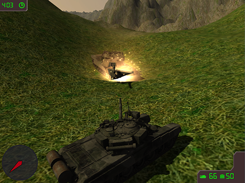

# Little Tank That Could 2: Try Harder

Little Tank That Could 2 was developed as a part of a Computer Graphics and Game Technology class. It is a "port" of the [original game](https://github.com/jenzy/Little-Tank-That-Could) the Unity Game Engine.

Little Tank That Could 2 is an arcade game in which the player controls a tank. The player must find and destroy all enemies before the timer runs out. This time, the enemy tanks fight back!

[Gameplay video](http://www.youtube.com/watch?v=O-CmcrJo8-I)    
[Download](../../releases/latest)

## The Prequel
[Little Tank That Could](https://github.com/jenzy/Little-Tank-That-Could), the original game  

## Libraries
[Unity](http://unity3d.com/)

